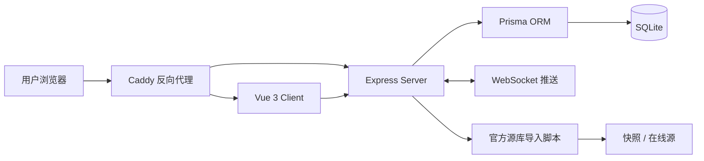

# 架构说明

本文档用于帮助公开仓库的使用者快速理解系统边界、模块职责、数据流与部署形态。

## 1. 设计目标

项目设计优先级如下：

- 个人或小团队可自托管
- 本地开发启动成本低
- 单机服务器可稳定部署
- 默认依赖尽量少
- 前后端职责清晰，便于二次开发

## 2. 逻辑架构

## 3. 模块职责

### 前端 `packages/client`

负责：

- 页面路由与权限入口
- 导师、面试、模板、资料、论坛等业务界面
- Markdown 风格的文书 / 笔记在线编辑
- 后台式检索、筛选、列表、详情与表单交互
- WebSocket 相关的前端提醒呈现

主要技术：

- Vue 3
- Vite
- Pinia
- Vue Router
- Naive UI
- UnoCSS

### 后端 `packages/server`

负责：

- REST API
- 用户认证与 JWT 会话校验
- 邮箱验证码、重置密码与 GitHub OAuth 流程
- 导师、面试、模板、资料、论坛、提醒等业务逻辑
- WebSocket 消息推送
- 数据导入导出与院校官方源库处理

主要技术：

- Node.js
- Express
- Prisma ORM
- WebSocket

### 共享层 `packages/shared`

负责：

- 前后端共享类型
- 公共常量
- 可复用的数据结构定义

### 数据层 `prisma`

负责：

- 数据模型定义
- 数据迁移
- 与 SQLite 的映射管理

默认采用 SQLite，原因是：

- 本地开发零额外服务依赖
- 单机部署成本低
- 适合当前产品阶段的用户规模与协作模式

## 4. 关键数据流

### 认证流

1. 用户在前端发起邮箱注册、邮箱验证码、重置密码或 GitHub OAuth
2. 后端完成身份校验、密码处理、令牌签发
3. 前端根据认证状态进入工作台
4. 敏感操作继续由服务端进行 JWT 校验

### 导师与资料管理流

1. 前端提交表单或检索条件
2. 后端完成参数校验、业务处理和数据库读写
3. 结果返回前端页面展示
4. 相关动作可触发论坛提醒或实时推送

### 官方源库导入流

1. 通过脚本从在线源抓取或从项目快照恢复
2. 统一清洗、结构化后写入数据库
3. 前端提供按学校 / 研究所维度的检索与筛选能力

## 5. 部署边界

### 本地开发

- 前端默认通过 Vite 启动
- 后端通过 Node.js / TypeScript 启动
- 数据库默认是本地 SQLite 文件

### 生产部署

推荐使用 Docker Compose：

- `app` 容器承载 Node.js 应用
- `caddy` 容器负责反向代理与 HTTPS
- 持久化数据放在服务器卷目录中

部署入口文档：

- [DEPLOY.md](../DEPLOY.md)

### 热发布链路

项目提供免重建热发布脚本，适合：

- 前端静态资源更新
- 后端构建产物替换
- 脚本与配置联动同步

这类方案的目标不是替代正式 CI/CD，而是在低成本单机环境下提升迭代效率。

## 6. 扩展点

当前架构便于后续扩展以下能力：

- SQLite 切换到 MySQL 等外部数据库
- 更强的全文搜索或院校数据索引
- 更细粒度的角色权限体系
- 更完整的自动化测试和发布流水线
- 更丰富的提醒渠道与通知聚合

## 7. 开源使用注意事项

公开仓库已去除私有部署信息，但你在自部署前仍需要自行配置：

- `.env` 中的真实环境变量
- SMTP 服务
- GitHub OAuth App
- 服务器域名与 HTTPS
- 真实数据备份策略

如果你准备基于本项目做较大规模二次开发，建议先阅读：

- [README.md](../README.md)
- [CONTRIBUTING.md](../CONTRIBUTING.md)
- [SECURITY.md](../SECURITY.md)
